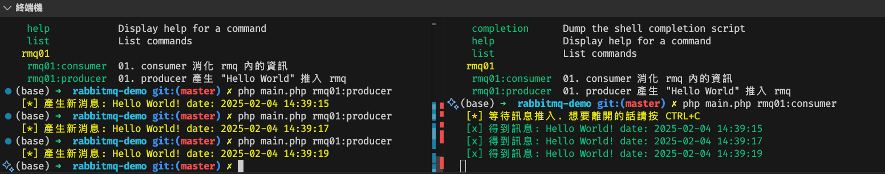
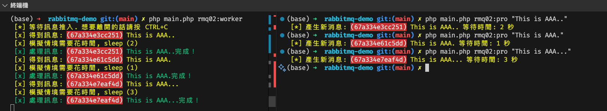
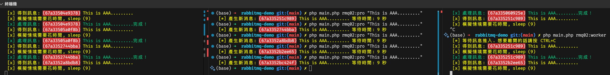
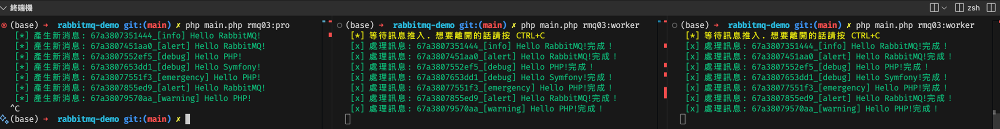
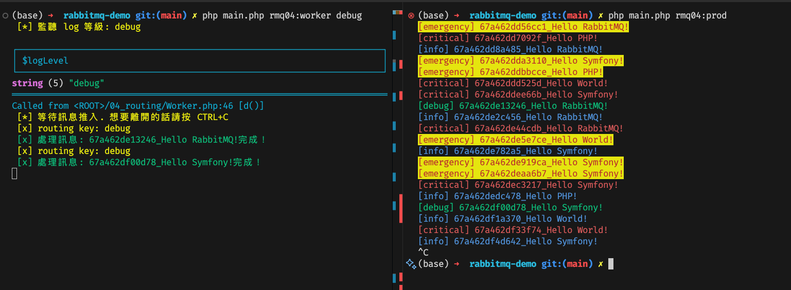
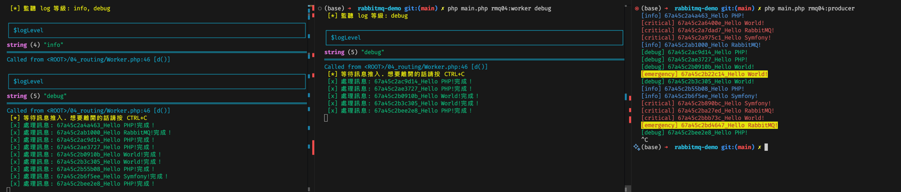

# RabbitMQ (rmq-php-repo)

> 該 repo 使用 symfony 進行console 的整理項目，主要是為了練習 RabbitMQ 的使用。<br/>
> 主要邏輯的話請看對應檔案 class 中的 `execute` 方法。

## 01. RabbitMQ exchange string
> 最基礎使用 RabbitMQ 的方式，透過 exchange string 來傳遞訊息。



自己嘗試使用：
```shell
php main.php rmq01:producer # 產生訊息
php main.php rmq01:consumer # 接收訊息(消化)
```


## 02. RabbitMQ exchange worker queue
> 使用 RabbitMQ 的 worker queue 來處理訊息，透過 worker queue 來平行處理訊息。

這邊使用傳入字串的 `.` 數量來模擬處理時間，可以看到消化的時間是依照處理時間來決定的。如下圖所示。

自己嘗試使用：
```shell
php main.php rmq02:producer "I am demo ..." # 產生訊息
php main.php rmq02:producer "I am demo ... this should wait 6 sec ..." # 產生訊息

php main.php rmq02:worker # 接收訊息(消化)
```




這邊使用兩個 worker 進行消化，可以看到兩個 worker 是平行處理訊息的。如下圖所示。
RabbitMQ 會自動分配給 worker 來處理訊息。



## 03. RabbitMQ publish / subscribe
> 使用 RabbitMQ 的 publish / subscribe 來處理訊息，透過 publish / subscribe 來處理訊息。<br/>
> 這邊使用 fanout 來處理訊息，因此多個 subscriber 會同時接收到訊息。<br/>
> 在這邊用多開同個程式來模擬多個 subscriber。在實際業務上可以用不同的程式來處理。



自己嘗試使用：
```shell
php main.php rmq03:producer # 產生假 log
php main.php rmq03:worker # 接收訊息(消化) 可以試著開多個 worker 來看看，會同時接收到多訊息。
```

## 04. RabbitMQ routing
> 使用 RabbitMQ 的 routing 來處理訊息，透過 routing 來處理訊息。<br/>
> 這邊使用 direct 來處理訊息，因此只有符合 routing key 的 subscriber 才會接收到訊息。<br/>
> 在這邊用多開同個程式來模擬多個 subscriber。在實際業務上可以用不同的程式來處理。<br/>
> <span style="color: red;">注意：routing key 必須是字串</span>


右邊的 terminal 產生假 log 紀錄推入 RabbitMQ 中，左邊的 terminal 進行消化。<br/>
並且左邊設定監聽的設定 `debug` 才接收


如果有重合到的 routing key 都會收到消息。

自己嘗試使用：
```shell
php main.php rmq04:producer # 產生假 log
php main.php rmq04:worker debug info # 接收訊息(消化) 可以試著開多個 worker 來看看，會同時接收到多訊息。
```